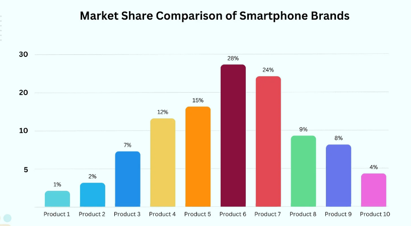
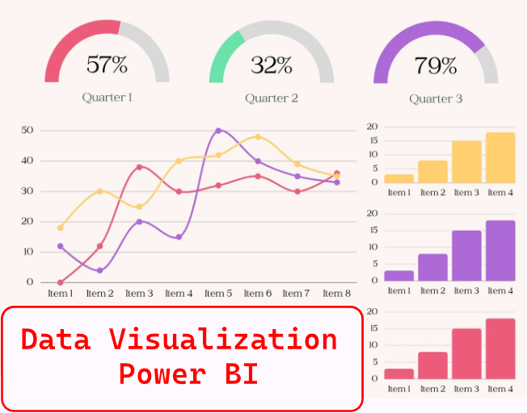

# Power-BI

  
  

------------------------------------------------------------------
👋 Hi, I’m @araderberg
👀 This repository is a collection of all data visualization projects from courses, labs and hands-on..

🌱 I’m currently working in the following certifications: Copy of the certifications will be uploaded here --> https://github.com/araderberg/Certificates

📊 - Google Data Analytics Professional Certificate - COMPLETED 
🎓 - SAS Certification - COMPLETED 
📜 - Google IT Data Automation using Python - COMPLETED 
🌐 - AWS Cloud - ONGOING 
📊 - Tableau Data Visualization - ONGOING 

💞️ I’m looking to collaborate on clinical research / data management / Artificial Intelligence projects.

📫 How to reach me: Online Presence:
[LinkedIn](https://www.linkedin.com/in/aaliyahraderberg/) | [Tableau](https://public.tableau.com/app/profile/aaliyahraderberg/vizzes) | [Kaggle](https://www.kaggle.com/aaliyahraderberg)
